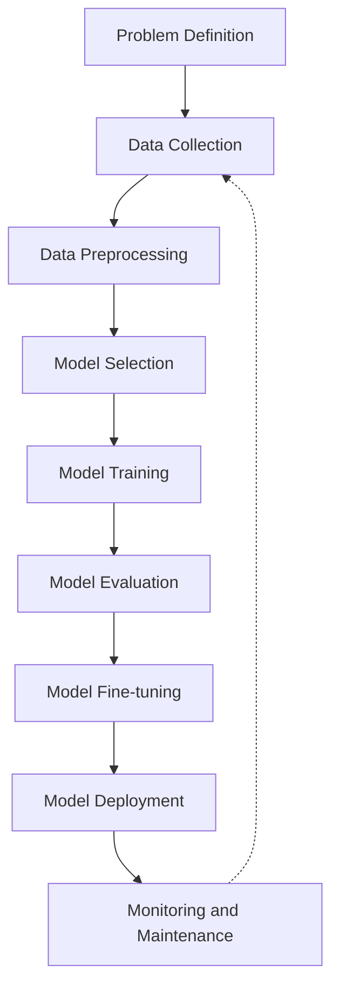
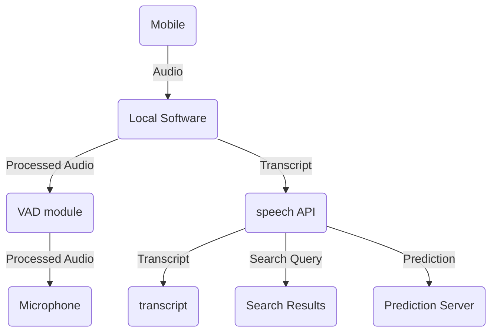
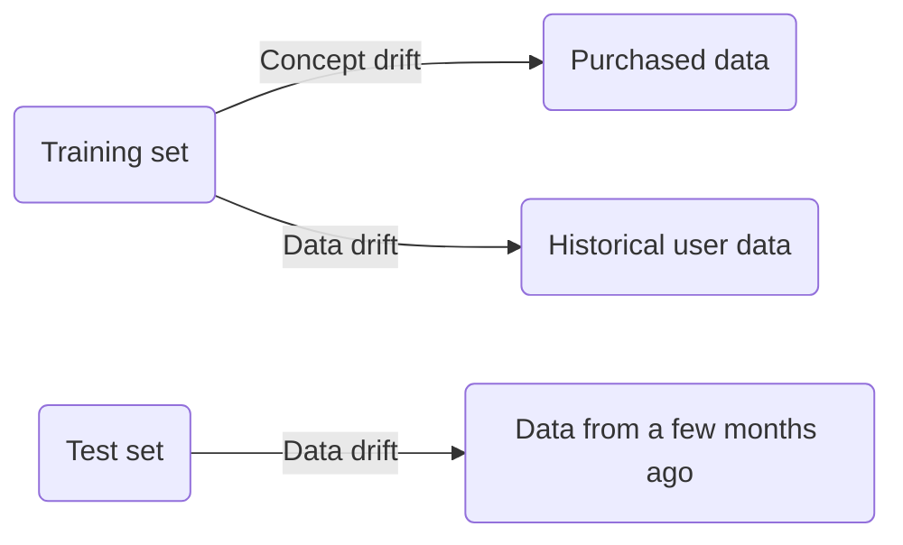
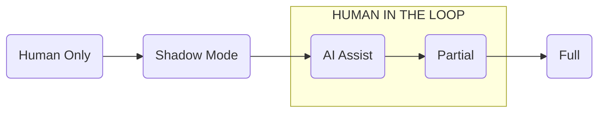
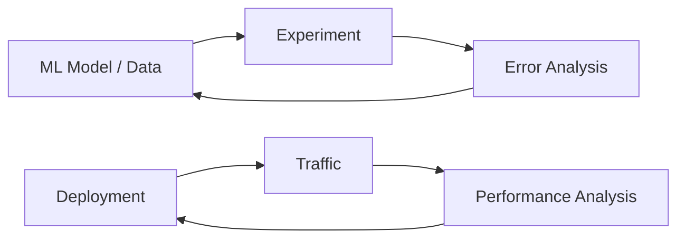
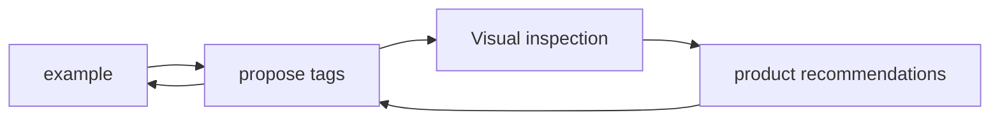
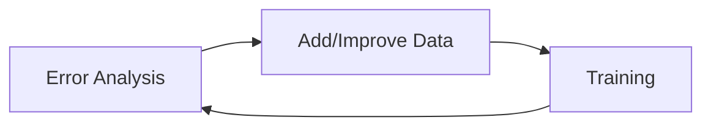

# ML Project Development and Lifecycle

#mlops #modeling 

## ML Code Contribution

ML code typically contributes to only 5-10% of the overall code in a machine learning project. The majority of the codebase is dedicated to various other aspects of the project.

## POC to Production Gap

One common challenge in ML projects is the gap between the proof-of-concept (POC) stage and production deployment. It often requires significant effort to bridge this gap and ensure a smooth transition from experimentation to a scalable, robust, and reliable production system.

## Requirements Surrounding ML Infrastructure

ML projects have specific requirements surrounding the infrastructure needed to support the development, deployment, and maintenance of machine learning models. The following components play crucial roles in ML infrastructure:

- ML Code: The actual machine learning algorithms and models.
- Configuration: Settings and parameters for training and deployment.
- Data Collection: Gathering relevant data for training and evaluation.
- Data Verification: Ensuring data quality, consistency, and integrity.
- Machine Resource Management: Optimizing resource allocation and utilization for efficient training and inference.
- Analysis Tools: Tools for data exploration, visualization, and model evaluation.
- Serving Infrastructure: Infrastructure to serve predictions and handle user requests.
- Monitoring: Continuous monitoring of model performance and system health.
- Process Management Tools: Tools for version control, collaboration, and reproducibility.
- Feature Extraction: Transforming raw data into meaningful features for model input.

## Lifecycle of an ML Project

1. Scoping: Defining the scope and goals of the project.

2. Define Project: Clearly articulate the problem statement and objectives.

3. Data: Define the data requirements and establish a baseline for comparison.

   - Define Data & Establish Baseline: Identify the necessary data and establish a starting point for comparison.
   - Label and Organize Data: Annotate and organize the data for training and evaluation.

5. Modeling: Select and train the machine learning model.

   - Select and Train Model: Choose an appropriate model and train it using the labeled data.
   - Perform Error Analysis: Analyze model performance and identify areas for improvement.

7. Deployment: Deploy the trained model in a production environment.

   - Deploy in Production: Integrate the model into the production system.
   - Monitor the System & Maintenance: Continuously monitor the system, evaluate model performance, and perform necessary maintenance.

## Requirements for a Valuable Commercial Project

To develop a valuable commercial ML project, several key considerations should be addressed:

- Decide on Project: Clearly define the project's purpose, objectives, and target audience.
- Decide on Metrics: Determine the evaluation metrics to assess the model's performance.
- Estimate Resource Requirements: Identify the necessary resources such as computing power, storage, and personnel.
- Define Data: Determine the data requirements and identify potential data sources.
- Consistent Data Labeling: Ensure consistent and accurate labeling of the data.
- Data Transformation: Determine how the data should be transformed or preprocessed before training.
- Code + Hyperparameters + Data -> ML Model: Combine code, hyperparameters, and data to create the ML model.
- Academia vs. Product: In academia, code and hyperparameters are often variable, while in product development, data and hyperparameters are variable.
- Perform Error Analysis and Optimize Code: Analyze model errors and optimize the code for improved performance.

## Example: Speech Recognition

In the context of speech recognition, the following architecture can be considered:

- Mobile devices capture audio through a microphone.

 >**MLOps** is an emerging discipline, and compromises a set of tools and principles to support progress through the ML project lifecycle.

## Concept & Data Drift Issues

Concept drift and data drift are important issues in machine learning projects. Concept drift refers to changes in the underlying relationships or patterns in the data, while data drift refers to changes in the distribution or characteristics of the data.

For example, consider a machine learning project with the following data:

- Training set: The initial dataset used for model training.
- Purchased data: Additional data acquired from external sources.
- Historical user data: Data collected over time from user interactions.
- Test set: A separate dataset used to evaluate the model's performance.
- Data from a few months ago: A subset of data representing an older timeframe.

Concept drift can occur when the relationship between features and the target variable changes. In the chart, concept drift is represented by the arrow from the training set to purchased data. It signifies that the patterns or relationships in the data may change over time, requiring the model to adapt to new patterns.

Data drift, on the other hand, refers to changes in the data distribution. The arrow from the training set to historical user data indicates that the data collected over time may have different characteristics compared to the original training set. Similarly, the arrow from the test set to data from a few months ago suggests that the data used for evaluation may no longer accurately represent the current data distribution.

An example of a sudden shock that can cause significant changes in data is the COVID-19 pandemic's impact on e-commerce and credit systems. The surge in e-commerce activities during the pandemic could affect credit systems, leading to changes in data patterns.

## Checklist of Questions to note S/W Engineering Issues

Here's a checklist of questions to consider when addressing software engineering issues in a machine learning project:

**Real-time or Batch data processing:** 
Determine whether the system needs to process data in real-time or can operate in batch mode.

**Cloud vs Edge or Browser deployment:** 
Decide whether the system should be deployed on cloud infrastructure, edge devices, or within a web browser.

**Compute resources:** 
Assess the required CPU, GPU, and memory resources for training and inference.

**Latency and throughput:** 
Consider the desired latency and throughput (queries per second) for processing data and delivering predictions.

**Logging:** 
Plan for proper logging mechanisms to capture relevant information for debugging, monitoring, and auditing purposes.

**Security and privacy:** 
Address security and privacy concerns, such as data encryption, access controls, and compliance with relevant regulations.

> **Deployment** --> software required and maintenance system. Note that concept / data drift should be considered.

## Common Deployment Cases

1. New product / capability : Do gradual growth
2. Automate / assist with manual task
3. Replace previous ML system

**Methods :** 
- Gradual ramp up with monitoring
- Rollback if new algorithm is not working

To verify the performance of the model :

**Shadow Mode** 
- ML System shadows the human and runs in parallel.
- ML system's output not used for any decisions during this phase.

**Canary Deployment** 
- Roll out to small fraction say 5% of traffic initially.
- Monitor system and ramp up traffic gradually.

**Blue-green Deployment**
- Old or blue version
- New or green version
- Router sends data to old version and then suddenly change to green version.
- Easy way to enable rollback

## Degree of Automation

> Human Only --> Shadow Mode --> AI Assistance (ex. frames to focus) --> partial automation (confidence based) --> full automation

Fig : Automation Degree increases from left to right

## Monitoring

**Software Metrics**
Memory, Compute, Latency, Throughput, Server load
**Input Metrics**
Changes or missing values, null values, quality of data (ex brightness of image)
**Output Metrics**
returns null, user redoes search, user switches input data method, CTR

> Just as ML modeling is iterative, so is deployment

Iterative process to choose the right set of metrics to monitor

- Set thresholds for alarms
- Manual retraining
- Automatic retraining

## Pipeline Monitoring

Beware of the cascading effects in the pipeline
- Software metrics
- Input & Output metrics
What to note ? How quickly do they change?

Seasonal Drift : Weekends happen every week and we don't need an alert. Unless we see a new pattern, of course.
Add manual post-processing rules or corrective co-efficient on top of the model output.
'Naive' retraining is not always enough.

## Challenges in Model Development

- Model development is an iterative process
- Algorithm/Code + Data + Hyperparameters -> ML Model
- **ML for Loan Approval** : Make sure not to discriminate by ethnicity, gender, location, language or other protected attributes.
- **Product recommendations from retailers :** Be careful to treat fairly all major user, retailer, and product categories.

- Doing well on training set
- Doing well on Dev / test set
- Doing well on business metrics / project goals.

> Low average test error isn't good enough!!!

- Skewed data distribution : 99% negative 1% positive

## Baseline 

- Establishing a baseline level of performance.
- Comparing accuracy to human level performance
- To establish a baseline
	- Human Level Performance
	- Literature search for state of the art / open source
	- Older System
- Baseline gives an estimat of the irreducible error or Bayes error and indicates what might be possible.
- Literature search to see what's possible.
- Find open-source implementations if available.
- A reasonable algorithm with good data will often outperform a great algorithm with not so good data.

> Should you take into account deployment constraints when picking a model ?
> **Yes**, if baseline is already established and goal is to build and deploy
> **No**, if purpose is to establish a baseline and determine what is possible and might be worth pursuing.

## Sanity-check for code and algorithm

- Try to overfit a small training dataset before training on a large one.
- This approach allows you to ensure that your model has enough capacity to learn from the data and capture its patterns effectively. 

## Iterative  process of error analysis

## Priorities 

Decide on most important categories to work on based on: 
- How much room for improvement there is. 
- How frequently that category appears. 
- How easy is to improve accuracy in that category. 
- How important it is to improve in that category.

For categories you want to prioritize: 
- Collect more data (or improve label accuracy) 
- Use data augmentation to get more data

## Skewed Datasets (Error Analysis & Performance Auditing)

1. Precision: Precision measures the accuracy of positive predictions by calculating the proportion of correctly predicted positive instances (true positives) out of all instances predicted as positive (true positives and false positives).

> $Precision = TP / (TP + FP)$

2. Recall: Recall, also known as sensitivity or true positive rate, quantifies the model's ability to identify positive instances by calculating the proportion of correctly predicted positive instances (true positives) out of all actual positive instances.

> $Recall = TP / (TP + FN)$

**print('0') case** : when all instances are classified in y = 0 column (or very few are classified in y=1) of confusion matrix.
- Precision -> tends  {0/0}
- Recall -> tends 0

$F_1-score$
- Recall must be of good value and not low.
- Combining recall and precision gives $F_1$ score.

> $F_1 = \frac{2}{\frac{1}{P} + \frac{1}{R}}$

For multi-class metrics, reject cases which measures bad $F_1$ score for better modeling.

## Performance Auditing

Check for accuracy, fairness and bias. 
1. Brainstorm the ways the system might go wrong. 
	-  Performance on subsets of data (e.g., ethnicity, gender). 
	- Prevalence of specific errors/outputs (e.g., FP, FN). 
	- Performance on rare classes. (includes rude-behavior example in speech -> gun instead of gan)
2. Establish metrics to assess performance against these issues on appropriate slices of data. 
3. Get business/product owner buy-in.

## Data-centric AI Dev

| Model Centric View                                                                        | Data Centric View                                                                                                        |
| ----------------------------------------------------------------------------------------- | ------------------------------------------------------------------------------------------------------------------------ |
| Collect what data you can, develop a model good enough to deal with the noise in the data | Consistency of the data is paramount. Use tools to improve the data quality; this will allow multiple models to do well. |
| Hold the data fixed and iteratively improve the code or model                             | Hold the code fixed and iteratively improve the data                                                                     |

## Data Iteration

- Speech Recognition Example
	- Car noise
	- Plane noise
	- Train noise
	- Machine noise
	- Cafe noise
	- Library noise
	- Food court noise

Categorize -> mechanical noise and non-mechanical noise.

![[Pasted image 20230710141659.png]]

Note the opportunity for improvement.
Try to collect more data for right side in this case, this will improve the performance of algorithm.
It may also improvise a little of left side as well. Potential*

- Augment your dataset -> merge noise with normal numbers

### Data Augmentation

- **GOAL :** Create realistic examples that the algorithm does poorly on, but humans do well on.
- Checklist -
	- Does it sound realistic?
	- Is the x->y mapping clear?
	- Is the algorithm currently doing poorly on it?

- Example -> increase or decrease contrast, increase or decrease brightness, photoshop... so on.
- Data Iteration Loop ->  

**Data Hurt Performance If :**

For unstructured data problems,
- The model is large (low bias)
- The mapping x->y is clear (eg given only the input x, humans can make accurate predictions)

**Photo OCR Counter Example**
I and 1 and T -> roman 1 can hurt i and 1.
